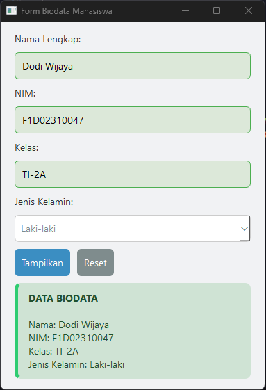
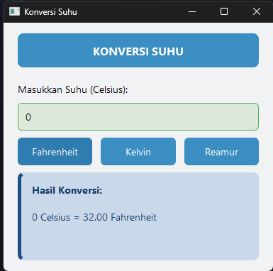
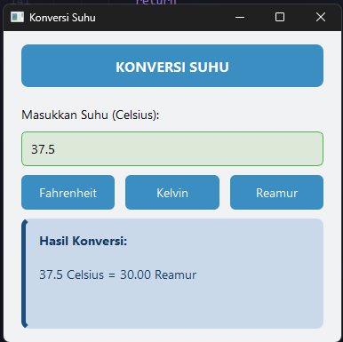
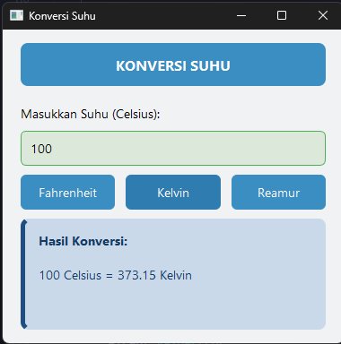
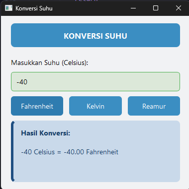

**Nama**  : Dodi Wijaya  
**NIM**   : F1D02310047  
**Kelas** : Pemrograman Visual D 
---
## Screenshot hasil program

## Tugas 1 Form Biodata Mahasiswa

---

## Tugas 2 konversi suhu

- suhu 0

- suhu 37.5

- suhu 100

- suhu -40

---
